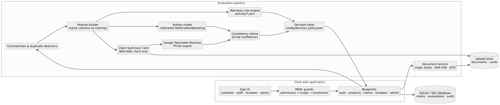
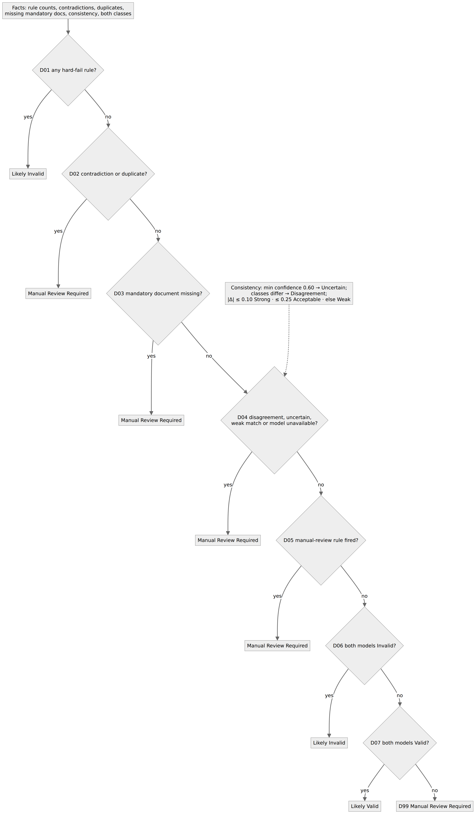

# AssureX Claim Engine

**Warranty claims decided by two independent models and a warranty rule engine you can read.**
*NextWave AI & ML — Aptech Limited*

Customers and service centers submit warranty claims with receipts and photos. A **Python classification
model** scores the structured claim record, a **Google Teachable Machine** image model scores a visual
**Claim Summary Card** of the same claim, a configurable **rule engine** checks the category's warranty
policy, and a config-driven **decision table** turns all of it into *Likely Valid*, *Likely Invalid* or
*Manual Review Required*. Anything uncertain goes to a human reviewer, and every step is recorded.



---

## Results (held-out test split, 225 claims never seen in training)

| | Value |
|---|---|
| Python model | HistGradientBoosting, sigmoid-calibrated (selected on the validation split from 3 algorithms) |
| Accuracy / macro F1 | **89.3% / 89.2%** (SRS target ≥ 85%) |
| Macro precision / recall | 89.5% / 89.3% |
| ROC-AUC (one-vs-rest) / log-loss / ECE | 0.948 / 0.406 / 0.082 |
| Best single feature on its own (leakage audit) | 52.9% (no field is a disguised label) |
| Teachable Machine model | `gtm-514702678b8c`: **93.8% test accuracy / 93.8% macro F1** (validation 97.3%) — see [Teachable Machine](#google-teachable-machine) |

All numbers come from `model/python_model/model_card_v2.json`, written by the training script. The
dataset carries 4% deliberate label noise (reviewer disagreement), so ~96% is the realistic ceiling.

---

## Quick start

Requirements: Python 3.10–3.12, Git. Works on Windows, macOS and Linux.

```bash
git clone https://github.com/Saba1512006/assurex-claim-engine.git
cd assurex-claim-engine
python -m venv venv
source venv/bin/activate            # Windows: .\venv\Scripts\Activate.ps1
pip install -r requirements.txt
python database/seed.py             # creates the database + demo data, writes .env with a random SECRET_KEY
python src/app.py                   # http://127.0.0.1:5000
```

Run the tests: `python -m pytest -q` (197 tests).
Production: `gunicorn wsgi:app` (Render uses `render.yaml`; PythonAnywhere's WSGI file imports `application`
from `wsgi.py`). Set `SECRET_KEY` in the environment — the app refuses to start without one.

### Evaluator accounts (demo data only)

| Role | Email | Password | Can |
|---|---|---|---|
| Customer | `customer@assurex.local` | `CustomerPass123!` | Register products, file claims, upload evidence, track |
| Service-center staff | `staff@assurex.local` | `StaffPass123!` | File claims and register products for walk-in customers of *their* center, record repairs |
| Claim reviewer | `reviewer@assurex.local` | `ReviewerPass123!` | Work the manual-review queue, decide, request information, override with a reason |
| Administrator | `admin@assurex.local` | `AdminPass123!` | Dashboards, analytics, policies, thresholds, models, users, audit trail, exports |

Public sign-up creates **customer** accounts only. Other roles are invited by an administrator
(*Access* page) and must set their own password at first sign-in.

---

## How to use it

| Task | Where |
|---|---|
| Register / sign in | `/register`, `/login` |
| Register a product and its warranty | *Products › Register product*. Upload the receipt first — it is read by OCR and fills the form; check every value. Choose standard or extended cover. |
| Add warranty information / documents | Product page › *Product documents* (receipt, warranty card, serial photo) — used by every claim on that product |
| Create a claim | *New claim* — 4 steps: product → what happened → evidence → review |
| Upload documents | Wizard step 3, or the claim page › *Evidence* while the claim is a draft, in review, or waiting for information |
| Verify extracted information | Wizard step 3 shows the values read from the receipt in editable fields; on the claim page each document has *Extracted details*. Corrections are audited. |
| Submit | Wizard *Submit claim* (or *Save as draft* then *Submit claim* on the claim page) |
| Python prediction & confidence | Claim page › *Model predictions & comparison*, left column: predicted class and probability for all three classes. Probabilities are calibrated: 0.80 means right ~80% of the time. |
| Claim Summary Card | Same panel, the card image (also *Evaluation history* › *card* for older runs) |
| Teachable Machine prediction | Same panel, right column (or “Model unavailable” until the export is installed) |
| Compare both models | Middle column: \|Δ top confidence\| and the consistency status; thresholds shown below |
| Warranty-rule results | *Warranty rules* card: triggered rules first, passed rules underneath |
| Contradictions / duplicates | Bottom of the rules card; duplicates also flag the claim in lists |
| Manual-review queue | Reviewer or admin › *Review queue* |
| Administrator dashboard | Admin › *Overview* (filters by category, status and date) and *Analytics* |
| Track a claim | Claim page › *Track*, or the 8-stage bar at the top of the claim page |
| Export a claim report | Claim page › *Report (PDF)*; bulk CSV from Admin › *Overview* / *Claims* |

### The 11 SRS demonstration cases

`python database/seed.py` creates one real claim for each case, submitted through the live pipeline:
valid, invalid (excluded damage), manual review (unknown cause), expired warranty, missing receipt,
duplicate (reused receipt and invoice), contradictory dates, serial mismatch, unauthorised repair,
boundary date (inside the grace period) and a model disagreement (*KitchenPro Oven 45L*: the image model
says Valid, the Python model Invalid, so the claim goes to a reviewer). The same cases
exist as feature records in [`sample_claims/`](sample_claims/README.md) and are pinned by
`tests/test_demonstration_cases.py`.

---

## How a claim is decided

1. **Evidence** — files are checked by magic bytes (not the extension), stored under random names,
   SHA-256 fingerprinted, and OCR-read (PDF text via pdfplumber; images via Tesseract when installed).
2. **Contradictions** — claim date vs purchase date, fault date vs purchase/claim dates, repair dates,
   and the registered serial / model / invoice / purchase date vs every value read from the evidence.
3. **Duplicates** — the same file hash on another product or claim, an invoice number registered to
   another product, another open claim on the same serial, a near-identical fault description, the
   same claimant repeating the same fault within 30 days.
4. **Features** — `src/core/features.py` builds exactly the 20 columns the model was trained on
   (product age, days to expiry, reporting delay, missing-document count, flags …).
5. **Rules** — `policies/<category>.json` decides each rule's severity: *hard fail*, *manual review*,
   *warning* (advisory) or off. Coverage, grace period, reporting deadline, excluded causes, evidence
   rules and repair history are all in the file.
6. **Python model** → class + 3 probabilities. **Claim Summary Card** (600×600, facts only, never a
   prediction) → **Teachable Machine** → class + 3 probabilities.
7. **Consistency** (`config/decision_policy.json`): top confidence below 0.60 → *Uncertain Result*;
   different classes → *Model Disagreement*; \|Δ\| ≤ 0.10 *Strong*, ≤ 0.25 *Acceptable*, otherwise *Weak Match*.
8. **Decision table** — first matching row wins: D01 hard fail → Likely Invalid; D02 contradiction or
   duplicate, D03 missing mandatory document, D04 disagreement / uncertain / weak / model unavailable,
   D05 manual-review rule → Manual Review Required; D06 both Invalid → Likely Invalid; D07 both Valid →
   Likely Valid; otherwise D99 Manual Review Required. `routing` maps each recommendation to a status.

Every evaluation is a new, immutable database row holding the exact inputs, both model versions
(file hashes), the card hash, the thresholds and the decision trace — updating a model never changes a
recorded result.



---

## Google Teachable Machine

The image model has to be trained on **teachablemachine.withgoogle.com**; it cannot be produced from
this repository, and there is deliberately **no substitute model**. The team's model is included in
`model/teachable_machine/` (93.8% on the 225 test cards). If it is removed, the comparison reports
*Uncertain Result* and every claim goes to manual review. To retrain:

1. Admin › *Models* › **Download training cards** (2,100 images in three class folders; validation and
   test cards are never included). Or use `data/summary_cards/train/{valid,invalid,manual_review}`.
2. Teachable Machine → Image project → Standard image model. Name the classes **Valid Claim**,
   **Invalid Claim**, **Manual Review** and upload each folder.
3. Train, then *Export Model → Tensorflow Lite → Floating point*.
4. Admin › *Models* › upload `model_unquant.tflite` + `labels.txt` (or copy them into
   `model/teachable_machine/`). The file is verified before it replaces anything; the old model is archived.
5. Click **Run evaluation** (or `python notebooks/evaluate_gtm.py`), then
   `python reports/generate_comparison_report.py` for the per-claim comparison report.

Runtime: `ai-edge-litert` (in requirements). `tflite-runtime` or full `tensorflow` also work.

---

## Reproduce the ML pipeline

```bash
python dataset_generator/generator_v2.py     # 1,500 claims, 500 per class, stratified 1050/225/225
python notebooks/train_python_v2.py          # 3 algorithms, 5-fold CV, select on validation, calibrate, model card
python dataset_generator/build_cards_v2.py   # 2 variations per training claim + 1 canonical card per val/test claim
python reports/generate_comparison_report.py # SRS model-comparison report (reports/model_comparison_report.*)
python reports/build_project_report.py       # documentation/PROJECT_REPORT.md -> reports/AssureX_Project_Report.pdf
```

Everything is seeded (seed 42) and deterministic: re-running produces byte-identical data and the same
model file hash.

---

## Security

Deny-by-default access control (`config/rbac.json`): permission → record scope (*own*, *service center*,
*assigned or queue*, *all*) → constraints (reviewers can't decide claims they filed, a claim can only move
along allowed transitions, overrides need a 20-character reason, admins can't demote themselves or the
last admin). Out-of-scope records return 404. Users are reloaded from the database on every request and a
role change or disable signs them out everywhere. Also: generic login errors, 5-attempt lockout, session
rotation, CSRF on every form, rate-limited sign-in, strict Content-Security-Policy (no inline or third-party
scripts), magic-byte upload validation, CSV formula-injection protection and an append-only audit trail.
Details: [`documentation/RBAC_DESIGN.md`](documentation/RBAC_DESIGN.md).

---

## Repository layout

```
config/            rbac.json, decision_policy.json, config.py
policies/          one warranty policy per category (JSON)
data/              raw + split CSVs, summary_cards/{train,val,test}, mapping file, statistics, data dictionary
dataset_generator/ generator_v2.py (records), build_cards_v2.py (cards)
notebooks/         train_python_v2.py, evaluate_gtm.py
model/             python_model/ (pipeline + model card), teachable_machine/ (export goes here)
src/core/          vocab, features, python + TM runtimes, card renderer, consistency, decision table, pipeline
src/rules/         policy store, rule engine, contradiction + duplicate detectors, validation
src/security/      RBAC policy engine and Flask guards
src/services/      claim lifecycle, documents, OCR glue, alerts, analytics, exports, PDF report, explanations
src/api/           Flask blueprints        templates/, static/   UI
database/          seed.py                 tests/                pytest suites
reports/           comparison report, project report builder
documentation/     project report, blog, evidence, installation, test cases, diagrams
```

## Known limitations

* The Teachable Machine model is trained in the browser and must be retrained by hand whenever the card
  design or the policy limits shown on the card change.
* The dataset is synthetic (generated from the policy with 4% label noise). Real claims will need
  retraining and re-calibration.
* OCR of **image** receipts needs the Tesseract binary; without it, images are accepted and the user types
  the details. PDF receipts with a text layer are read without Tesseract.
* SQLite is the default database; use `DATABASE_URL` (e.g. PostgreSQL) and a shared rate-limit store
  (`RATELIMIT_STORAGE_URI`) for multi-worker production.

## Links

* Live deployment: https://assurexai.pythonanywhere.com (redeploy and re-seed after pulling this version)
* Demonstration video (.mp4): *to be added* — recording script in [`documentation/DEMO_VIDEO_SCRIPT.md`](documentation/DEMO_VIDEO_SCRIPT.md)
* Published blog (Medium): https://medium.com/@sabarajput672/building-assurex-two-models-one-rulebook-and-why-our-first-100-was-a-bug-bb8b9858b11c
* Technical blog, current text: `/blog` in the app ([`documentation/TECHNICAL_BLOG.md`](documentation/TECHNICAL_BLOG.md))
* Project report: [`documentation/PROJECT_REPORT.md`](documentation/PROJECT_REPORT.md)
* Installation & troubleshooting: [`documentation/INSTALLATION.md`](documentation/INSTALLATION.md)
* Test cases: [`documentation/TEST_CASES.md`](documentation/TEST_CASES.md)
* AI tool declaration: [`AI_USAGE.md`](AI_USAGE.md)

## License

MIT — see [LICENSE](LICENSE).
