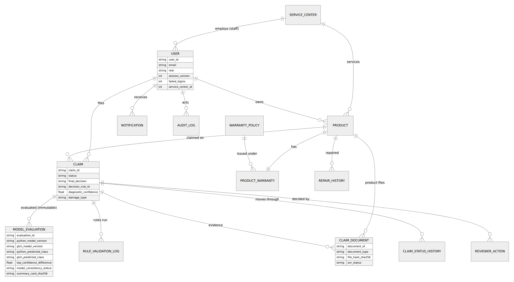
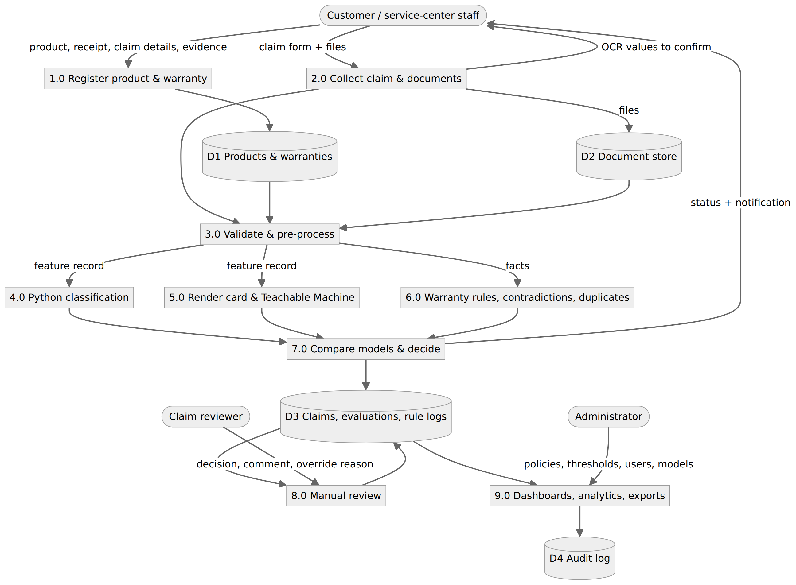
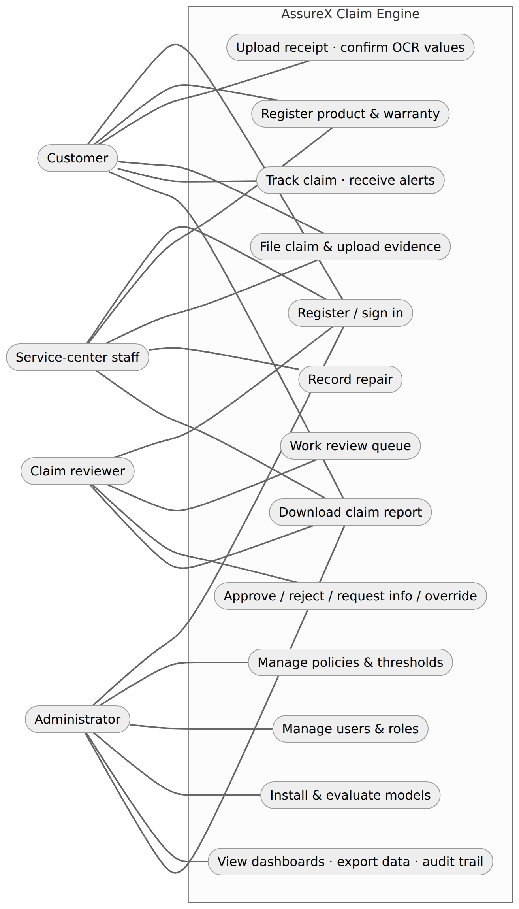
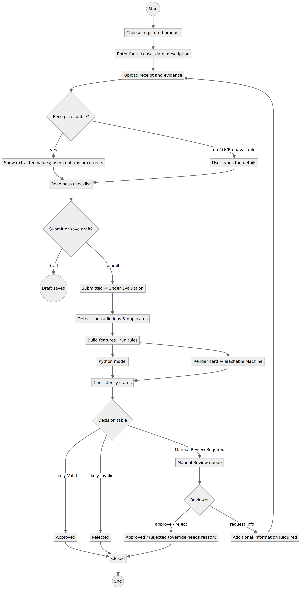
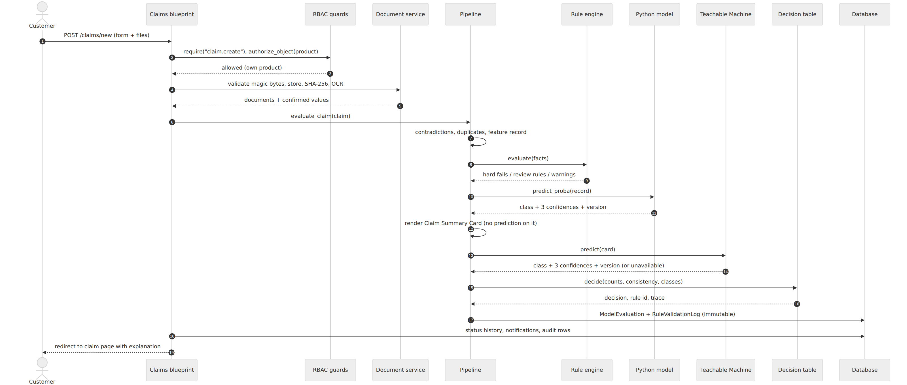

# AssureX Claim Engine — Project Report

NextWave AI & ML · Aptech Limited · Version 2.0 (September 2026)

## 1. Problem definition

Manufacturers and service centers receive warranty claims that must be checked against purchase proof,
product age, warranty terms, exclusions, repair history and supporting evidence. Done by hand this is
slow, inconsistent between staff, and easy to defeat with reused receipts, altered dates or mismatched
serial numbers. AssureX automates the checking and produces a recommendation — *Likely Valid*,
*Likely Invalid* or *Manual Review Required* — that is explained, audited and sent to a person whenever the
evidence is uncertain.

## 2. Background and business necessity

Warranty cost is a direct expense for manufacturers and a satisfaction driver for customers. Typical
failure modes of manual review are: approving claims filed after the warranty and its grace period,
missing exclusions (drops, liquid damage), accepting the same invoice twice, and inconsistent decisions for
identical cases. An automated first pass that applies the policy the same way every time, flags
contradictions and duplicates, and routes only the unclear cases to reviewers shortens turnaround and makes
decisions defensible.

## 3. Proposed solution

A Python/Flask web application in which:

1. customers (or service-center staff for walk-in customers) register products and warranties and file
   claims with receipts, warranty cards, photos, videos and diagnostic reports;
2. documents are validated, fingerprinted (SHA-256) and read by OCR; the user confirms extracted values;
3. the claim is converted into a structured feature record and scored by a **Python classification model**;
4. the same record is drawn as a **Claim Summary Card** image and scored independently by a
   **Google Teachable Machine** model;
5. a **rule engine** checks the category's warranty policy; detectors look for **contradictions** and
   **duplicates**;
6. a configurable **decision table** combines rules, both predictions and their **consistency status** into
   the final recommendation; uncertain claims enter a **manual-review queue**;
7. reviewers decide (with overrides that require a reason), customers track progress through eight stages,
   and administrators see dashboards, analytics, exports and a full audit trail.

## 4. Purpose of the document

This report describes the requirements, design, data, models, testing and limitations of AssureX so that
evaluators, maintainers and stakeholders share one understanding of what was built and how to verify it.

## 5. Scope

In scope: registration and authentication for four roles, product/warranty records, receipt upload and
OCR, claim intake, evidence management, repair history, validation and pre-processing, the common dataset,
both models, comparison, warranty rules, contradiction/duplicate/missing-document detection, claim summary
and explanation, manual review, tracking, notifications and alerts, dashboards, search, analytics, PDF
reports, CSV export, audit trail, model versioning, error handling and monitoring.
Out of scope (SRS §1.4): live manufacturer databases, payment systems, enterprise warranty platforms.

## 6. Assumptions

* Claims arrive through the web interface; a claim concerns one registered product with one warranty.
* Service-center staff belong to one service center; products may name a preferred authorised center.
* The warranty policy for a category is the JSON file in `policies/`; changing it changes future
  evaluations only.
* Diagnostic confidence (0–1) comes from a technician; if nobody assessed the fault it is 0.5 (neutral).
* The training data is synthetic, generated from the policy with 4% label noise.

## 7. Constraints

* Quality depends on the completeness and honesty of the submitted evidence (SRS §1.5).
* The dataset size (1,500 claims) limits how much rare scenarios can be learned (e.g. late reporting).
* The two models are trained independently and do not produce identical confidences; the comparison
  thresholds absorb normal differences.
* Teachable Machine training happens in the browser and must be repeated by hand when cards change.
* Personal data (names, contact details, receipts) must be protected: role-scoped access, no public file
  URLs, audit logging, and demo data only in the repository.

## 8. Functional requirements (SRS §1.6) — where each is implemented

| # | Requirement | Implementation |
|---|---|---|
| i | Registration & authentication, role-based access | `src/api/auth.py`, `src/security/`, `config/rbac.json` — customer self-sign-up, other roles invited |
| ii | Profile, unique User ID | `/profile`, `User.user_id` (USR-…) |
| iii | Product registration, Product ID | `/products/new`, `Product.product_id` (PRD-…) |
| iv | Standard & extended warranties, provider, dates, conditions, exclusions, service center; active/expired/expiring view | `ProductWarranty`, product page, product list filters |
| v | Upload receipts/invoices/warranty cards (PDF/JPG/JPEG/PNG) | `src/services/documents.py` (magic-byte validation) |
| vi | Extract purchase date, invoice, product, model, serial, retailer, amount, warranty length | `src/ocr/document_processor.py` |
| vii | Show extracted values, let users correct them | Wizard step 3, product form auto-fill, claim page *Extracted details* (audited) |
| viii | Warranty dates, remaining period, active/expired/expiring/extended | `ProductWarranty.status`, life-used bars |
| ix | Expiry alerts with admin-configured window | `src/services/alert_service.py`, Admin › Policies › alerts |
| x | Claim registration by users or staff, Claim ID, links | `/claims/new`, `Claim.claim_id` (CLM-…) |
| xi | Claim information (age, purchase, fault date, description, cause, service history, replacement, submission date) | Wizard step 2, `Claim` model |
| xii | Photos, damage images, videos, serial photos, diagnostic reports | Eight evidence types incl. MP4 video |
| xiii | Repair history (dates, center, parts, outcome, cost, authorised or not) | `RepairHistory`, product page (staff) |
| xiv | Documents organised per product and claim; view/download/replace/remove by rights | Product and claim evidence panels, `document.*` permissions |
| xv | Validation: mandatory fields, dates, numbers, file types, sizes, duplicate IDs | `src/rules/validator.py`, `documents.validate`, unique DB constraints |
| xvi | Pre-processing: missing values, dates, encoding, normalisation, derived fields | `src/core/features.py` + saved sklearn pipeline |
| xvii | Common dataset in CSV and card form | `data/`, `dataset_generator/` |
| xviii | Train & compare algorithms, select best | `notebooks/train_python_v2.py` |
| xix | Python confidence for all three classes | Claim page, stored per evaluation |
| xx | Claim Summary Card without prediction/decision | `src/core/card_v2.py` |
| xxi | Teachable Machine classification | `src/core/gtm_classifier_v2.py` |
| xxii–xxiv | Class match, \|Δ confidence\|, five consistency statuses with configurable thresholds | `src/core/consistency.py`, `config/decision_policy.json` |
| xxv–xxvi | Warranty rule validation, configurable per category | `src/rules/policy_engine.py`, `policies/*.json`, Admin › Policies |
| xxvii | Serial number vs receipt, warranty card, product image, repair records | `src/rules/contradiction_detector.py` |
| xxviii | Contradictions (dates, models, serials) | same |
| xxix | Missing mandatory documents, telling the user which | Policy `mandatory_documents` / `supporting_documents`, checklist, notifications |
| xxx–xxxi | Duplicate claims and documents (IDs, invoices, serials, descriptions, claimant, hashes, history) | `src/rules/duplicate_detector.py` |
| xxxii | Claim summary | `src/services/explain.py → summarise` (template-based, no external AI) |
| xxxiii | Claim preparation assistance | Live readiness checklist in the wizard |
| xxxiv | Final decision from all factors | `src/core/pipeline.py`, decision table |
| xxxv | Explanation: supporting/opposing factors, rules passed/failed, contradictions, evidence needed | `explain.py → explain`, claim page |
| xxxvi–xxxvii | Manual-review queue, approve/reject/request info, comments, override with reason, original AI result kept | `src/api/reviewer.py`, `ReviewerAction` |
| xxxviii | Eight tracked stages | `Claim.transition_status`, stage bar, tracking page |
| xxxix | Notifications (expiry, submission, missing docs, info requests, status, review, approval, rejection) | `src/services/notifications.py`, bell menu, dashboard |
| xl | User dashboard | `/claims/` |
| xli | Admin dashboard (totals, classes, pending, duplicates, disagreements, average confidences, trend) | `/admin/dashboard` |
| xlii | Search & filter by claim, product, category, serial, warranty status, claim status, risk, confidence, reviewer, dates | `/claims/search` |
| xliii | Analytics (outcomes, faults, rejection reasons, categories, expirations, repairs, model performance, manual-review frequency) | `/admin/analytics` |
| xliv | Downloadable claim report | `/claims/<id>/report.pdf` (`src/services/report_generator.py`) |
| xlv | CSV/Excel export | `/admin/export/<kind>` |
| xlvi | Secure database storage | SQLAlchemy models, SQLite/any SQL |
| xlvii | Audit trail | `AuditLog`, `src/services/audit.py`, Admin › Audit |
| xlviii | Model version tracking; updates don't alter recorded results | Hash-based versions on every `ModelEvaluation` row; rows never updated |
| xlix | Understandable errors | Friendly error pages and flash messages; model/OCR failures degrade gracefully |
| l | Monitoring & anomaly alerts | `alert_service.anomalies()` on the admin dashboard; *Send due alerts* |

## 9. Non-functional requirements

| NFR | Result |
|---|---|
| Performance ≤ 5 s | Full evaluation (rules + Python + card + image model + decision) ~150–300 ms on a laptop; stored per claim (`latency_ms`) and tested |
| Scalability (10,000 claims, several centers, concurrent users) | Indexed columns (claim_id, status, reviewer, serial, hashes); scoped SQL queries; stateless workers; any SQL database via `DATABASE_URL` |
| Usability | Four-step wizard with live checklist, plain-language explanations, responsive layout (390 px phones and up), light/dark themes, keyboard focus styles |
| Accuracy ≥ 85% | Python model 89.3%, Teachable Machine 93.8% on the 225 unseen test claims |
| Availability ≥ 99% | Stateless app behind gunicorn; `/healthz` for uptime monitors; no runtime dependency on external APIs or CDNs |

## 10. Application architecture

Three layers: the **web layer** (Jinja templates, a design-system stylesheet and one JavaScript file; the
Content-Security-Policy forbids inline and third-party scripts), the **application layer** (Flask
blueprints guarded by the RBAC engine; services for the claim lifecycle, documents, alerts, analytics,
exports and reports) and the **evaluation layer** (feature builder, rule engine, detectors, both model
runtimes, card renderer, consistency and decision table). Persistence is SQLAlchemy over SQLite by default
plus a file store for documents and cards.

## 11. Module descriptions

| Module | Responsibility |
|---|---|
| `src/core/vocab.py` | Single vocabulary: categories, damage types, faults, classes, document types, date formats |
| `src/core/features.py` | Pre-processing and feature engineering for a stored claim |
| `src/core/python_classifier.py` | Loads the versioned sklearn pipeline; never retrains itself |
| `src/core/card_v2.py` | Deterministic 600×600 card renderer (v3 tile design) with bundled fonts |
| `src/core/gtm_classifier_v2.py` | Teachable Machine TFLite runtime, label parsing, version hashing |
| `src/core/consistency.py`, `decision_table.py` | Five statuses; first-match decision table with validation and safe saving |
| `src/core/pipeline.py` | Orchestration and immutable persistence of each evaluation |
| `src/core/offline_eval.py` | Same pipeline over the val/test splits for evaluation and reports |
| `src/rules/policy_store.py` | Loads/validates/saves policy JSON; rule catalogue |
| `src/rules/policy_engine.py` | Sixteen rule checks; severity from policy |
| `src/rules/contradiction_detector.py`, `duplicate_detector.py` | Evidence consistency and duplicate indicators |
| `src/rules/validator.py` | Form validation and preparation checklist |
| `src/security/rbac.py`, `guards.py` | Permission → scope → constraint engine; request hooks, decorators, scoped queries, login hardening |
| `src/services/*` | Claim lifecycle, documents, notifications, audit, alerts, analytics, exports, PDF report, summaries |
| `src/api/*` | Public, auth, products, claims, reviewer, admin, access-control blueprints |

## 12. Database design

Fifteen tables. Key points: public identifiers (USR-, PRD-, CLM-, DOC-, EVL-) are random and unique;
`claims` carries status, recommendation, decision rule and flags; `model_evaluations` stores the exact
feature record, both predictions with all three confidences, model versions, card hash, thresholds and the
decision trace — one row per run, never updated; `rule_validation_logs` stores every rule with its severity
and message plus contradictions, duplicate indicators and missing documents; `claim_status_histories` and
`audit_logs` are append-only; `users` hold security state (session version, failed logins, lockout,
forced password change, service center).

## 13. Data dictionary

The dataset columns are documented in `data/data_dictionary.json` (37 columns: identifiers, descriptive
fields, 20 model features, scenario and label). Database fields are documented in
`src/models/entities.py`.

## 14. Data flow diagram

## 15. Use case diagram

## 16. Activity diagram

## 17. Sequence diagram

## 18. Decision flow diagram

## 19. Rule-engine design

Each category has a JSON policy with coverage, standard terms, extension length, start conditions, grace
period, reporting period, covered faults, excluded damage causes (plus human-readable exclusions),
diagnosis threshold for confirming an exclusion, repeat-repair threshold, repair and replacement
conditions, authorised-center requirement, mandatory and supporting documents, and three rule lists:
`hard_fail_rules`, `manual_review_rules`, `warning_rules`. The engine has sixteen checks
(e.g. WARRANTY_EXPIRED, GRACE_PERIOD, EXCLUDED_DAMAGE, SERIAL_MISMATCH, LATE_REPORTING, INCOMPLETE_EVIDENCE);
which list a rule is in decides its severity, and a rule in no list is off. Every result — fired or passed
— is stored with a message, so the explanation can show rules passed and failed. Files are validated
against the vocabulary on load and on every admin save (atomic write, audited).

## 20. Python classification model design

Feature record (8 numeric, 10 binary, 2 categorical) → `ColumnTransformer` (scaler for the linear model,
one-hot with fixed categories) → candidate classifier. Three candidates compared with stratified 5-fold CV
and a validation split; the best on validation macro-F1 is wrapped in sigmoid calibration (5-fold) and saved
as one pipeline artefact with its feature list and library version. Full evidence:
`documentation/PYTHON_MODEL_EVIDENCE.md`.

## 21. Google Teachable Machine model design

Standard image model trained on 2,100 Claim Summary Cards (700 per class; two variations of each training
claim), exported as TensorFlow Lite. The card (v3) shows each claim fact against its policy limit as one of
nine large colour-and-glyph tiles in a fixed 3 × 3 grid (coverage, reporting time, damage cause, receipt,
supporting evidence, serial, dates, invoice, repairs), because Teachable Machine classifies with frozen
ImageNet features and cannot read small text. Procedure and status: `documentation/GTM_EVIDENCE.md`.

## 22. Dataset description

1,500 claims, exactly 500 per class, across three categories (Consumer Electronics 464, Home Appliances 514,
Industrial Tools 522). Scenarios (from the ground-truth policy): covered defect 487, expired 223, missing
documents 144, ambiguous cause 127, unauthorised repair 98, grace boundary 80, excluded damage 76, serial
mismatch 60, contradiction 51, repeat repairs 35, possible duplicate 31, late reporting 23, plus 63
noise-flipped labels. This covers the SRS's normal, incomplete, contradictory, complex and borderline cases.

## 23. Dataset-generation method

`dataset_generator/generator_v2.py`: attributes are sampled from realistic, overlapping distributions
independently of the class (where in the warranty life the claim falls, reporting delay, damage cause by
category, diagnosis, repairs, documents, serial match, duplicate invoice, date conflict). The label is then
**derived** by an adjudication function that mirrors the policy files, and 4% of labels are flipped to model
reviewer disagreement. Records are drawn until each class has 500, shuffled, and only then given claim IDs.
A stratified 70/15/15 split follows, before any card is rendered. v1 had a `damage_type` column that was a
renamed label and claim IDs ordered by class; both are fixed and tested.

## 24. Data pre-processing and feature engineering

Dates parsed with seven accepted formats; derived fields (product age, days to expiry, remaining warranty,
reporting delay, missing-document count, repair count, unauthorised-repair / serial-mismatch /
duplicate-invoice / date-conflict flags); missing documents → 0; unassessed diagnosis → 0.5; categorical
values validated against the vocabulary and one-hot encoded with fixed categories; numeric scaling inside
the pipeline for the linear candidate.

## 25. Python model-training procedure

`python notebooks/train_python_v2.py`: leakage audit (fails above 90%) → 5-fold CV and validation metrics for
each candidate → select on validation → permutation importance → calibrate → one-time test evaluation
(accuracy, macro precision/recall/F1, ROC-AUC, log-loss, ECE, confusion matrix, per-class report, 30 sample
predictions) → save pipeline and model card. Asserts accuracy ≥ 85%.

## 26. Google Teachable Machine training procedure

See `documentation/GTM_EVIDENCE.md` §“Training procedure”. After export the model is uploaded in
Admin › Models, validated, versioned, and evaluated on the 450 held-out cards.

## 27. Model evaluation

| Model | Accuracy | Macro precision | Macro recall | Macro F1 | ROC-AUC |
|---|---|---|---|---|---|
| Python (HistGradientBoosting, calibrated), test | 89.3% | 89.5% | 89.3% | 89.2% | 0.948 |
| Teachable Machine (`gtm-514702678b8c`), test | 93.8% | 94.0% | 93.8% | 93.8% | — |

## 28. Confusion matrix (Python model, test)

| actual \ predicted | Invalid | Manual Review | Valid |
|---|---|---|---|
| Invalid Claim | 61 | 8 | 6 |
| Manual Review | 2 | 69 | 4 |
| Valid Claim | 3 | 1 | 71 |

## 29. Accuracy, precision, recall and F1 by class (Python model, test)

| Class | Precision | Recall | F1 |
|---|---|---|---|
| Invalid Claim | 92.4% | 81.3% | 86.5% |
| Manual Review | 88.5% | 92.0% | 90.2% |
| Valid Claim | 87.7% | 94.7% | 91.0% |

## 30. Model prediction and confidence comparison

`reports/generate_comparison_report.py` produces `reports/model_comparison_report.csv/.md` for the test
claims with every SRS column (IDs, actual class, both predictions and confidences, card filename, match,
difference, status, rule result, missing documents, contradictions, duplicates, final decision, explanation of
disagreements, summary). Consistency rules: minimum top confidence 0.60 (else *Uncertain Result*); different
classes → *Model Disagreement*; \|Δ\| ≤ 0.10 *Strong*, ≤ 0.25 *Acceptable*, otherwise *Weak Match*; the
latter three statuses and disagreement all route to manual review. On the test claims the two models agree
on 92.9%. If the Teachable Machine export is missing, the report states that its columns are unavailable
rather than estimating them.

Design check with a simulated agreeing image model (not a reported metric): the rules + decision table map
93.3% of test claims to their labelled class, and 10 of the 15 remaining differences are the deliberately
noisy labels — i.e. the combination is sound once the second model is in place.

## 31. Testing strategy

197 automated pytest tests across unit (rules, detectors, OCR patterns, consistency, RBAC policy),
integration (full HTTP journeys through the real app, DB and file store), boundary, negative, security,
database, model and demonstration cases; surprise-modification scenarios are tests too. Catalogue:
`documentation/TEST_CASES.md`. Additionally every page is rendered for every role, and browser screenshots
are taken at desktop and mobile widths.

## 32. Security considerations

Deny-by-default RBAC with record scopes and separation of duties; out-of-scope records return 404; user
state reloaded per request with session versioning (role change/disable signs out everywhere); idle timeout;
generic login errors, five-attempt lockout, session rotation, rate-limited sign-in; public sign-up limited to
customers; forced password change for invited users; CSRF tokens on all forms; strict CSP, clickjacking and
MIME-sniffing protection; uploads validated by magic bytes, stored under random names outside the web root
and served only through permission checks; CSV formula-injection guard; parameterised queries via the ORM;
secrets from the environment; append-only audit including denied access. Design and v1 loophole list:
`documentation/RBAC_DESIGN.md`.

## 33. Privacy considerations

Only data needed to decide a claim is collected. Each role sees only its scope; documents are never publicly
addressable; exports require an explicit permission and are audited. The repository contains only
fictitious demo data and synthetic images. Deployments should use HTTPS (secure cookies are on by default),
restrict database backups, and define a retention period for closed claims and uploaded files.

## 34. Limitations

* The Teachable Machine model must be retrained in the browser whenever the card design or policy limits change.
* Synthetic training data; rare scenarios (late reporting) are learned less well; real data needs retraining.
* Image OCR requires Tesseract on the server.
* Duplicate text similarity is lexical (≥ 90% sequence match), not semantic.
* SQLite and in-memory rate limits suit a single server; use PostgreSQL/Redis for multiple workers.

## 35. Future enhancements

Retrain on real claims with periodic recalibration and drift monitoring; active learning from reviewer
overrides; image-based damage detection on customer photos; semantic duplicate detection; email/SMS
notifications; multi-tenant manufacturer support; REST API for service-center systems; database migrations
with Alembic.
